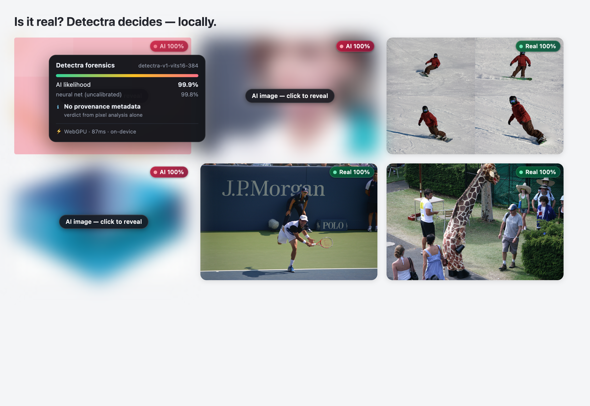
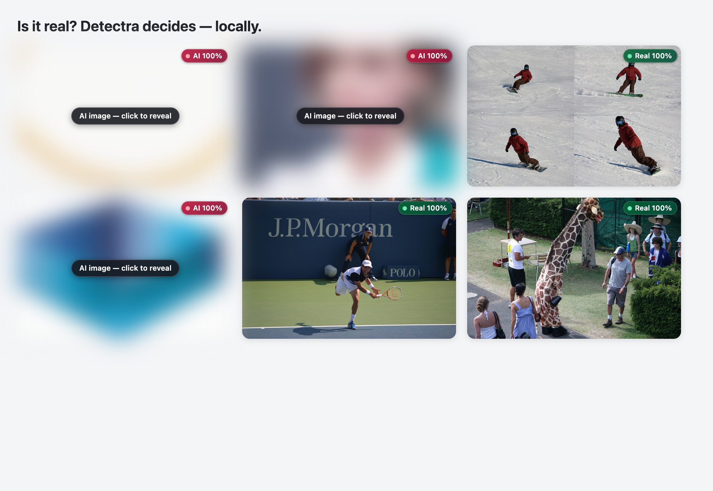

# Detectra — AI Image Detector for Chrome, 100% on-device

Detectra spots AI-generated images while you browse and pins a confidence score
on every image — with **all inference running inside your browser**. No cloud
APIs, no local servers, no telemetry: after a one-time model download, Detectra
works fully offline. Your images never leave your machine.



A Manifest V3 extension that performs real neural-network inference via
**WebGPU** (WASM fallback) and layers cryptographic provenance and metadata
forensics on top.

## Results

Measured **through the real extension** (Chrome for Testing + the exact
service-worker WebGPU pipeline a user gets), at a 65% confidence decision
threshold, on data the model never trained or calibrated on:

| Benchmark | Balanced accuracy @0.65 |
|---|---|
| [WildRF](https://vision.huji.ac.il/ladeda/) test — 2,241 in-the-wild social-media images (Reddit/X/Facebook), fully held out | **97.6%** |
| WildRF test, mangled (random 0.5–0.9× resize + JPEG q60–88) | **97.1%** |
| Modern-generator eval split — DALL·E 3, Midjourney, Flux, SD3.5, Recraft, HiDream, **plus GPT-4o & Ideogram which the model never saw in training** | **98.3%** (TPR 100%) |

The Detectra model — published at
[Vontra/detectra-v1](https://huggingface.co/Vontra/detectra-v1) — is our own
fine-tune of the MIT-licensed
[Community Forensics](https://github.com/JeongsooP/Community-Forensics) ViT-S/16
(CVPR 2025), retrained on the current generation of image models with a
web-realism augmentation policy (JPEG cascades, resize chains) and a replay
slice of the original 4,800-generator corpus. Scores are Platt-calibrated so
the 0.65 decision threshold sits at the balanced-accuracy optimum.
Holdout discipline: GPT-4o and Ideogram never appear in training; WildRF-test
is never touched by training *or* calibration.

## How it works

Every eligible image on a page goes through a four-signal forensic pipeline:

1. **Neural pixel analysis** — a ViT-S/16 detector (fine-tuned from the MIT-licensed
   [Community Forensics](https://github.com/JeongsooP/Community-Forensics) ViT,
   CVPR 2025, trained across 4,800+ generators) runs at 384×384 via ONNX
   Runtime Web on WebGPU. ~30ms/image on Apple Silicon; single-threaded WASM
   fallback for machines without WebGPU.
2. **C2PA / Content Credentials** — JUMBF manifests in JPEG/PNG/WebP are
   detected and the claim generator parsed (DALL·E, Adobe Firefly, GPT-4o…).
3. **Generator metadata forensics** — Stable Diffusion WebUI `parameters`
   chunks, ComfyUI workflow graphs, NovelAI tags, Midjourney XMP job IDs,
   EXIF `Software` fields, and the IPTC `digitalSourceType =
   trainedAlgorithmicMedia` marker.
4. **Score fusion + calibration** — the neural logit is Platt-calibrated so
   the 65% displayed-confidence threshold sits at the balanced-accuracy
   optimum; hard metadata evidence can only *raise* the score (absence of
   metadata proves nothing, and camera EXIF is spoofable — it is surfaced as
   context, never trusted).

Hover any badge for the full forensic breakdown: neural score (raw and
calibrated), every provenance signal found, engine (WebGPU/WASM), and timing.

Images called AI at the 65% threshold are also **auto-blurred** with a
click-to-reveal chip (toggle it from the popup), so synthetic content never
ambushes you mid-scroll:



## Install

```bash
npm ci
npm run build
```

Then in Chrome: `chrome://extensions` → enable **Developer mode** → **Load
unpacked** → select `extension/dist`.

On first run Detectra performs its one-time model download (~44MB from
[Vontra/detectra-v1](https://huggingface.co/Vontra/detectra-v1), SHA-256
verified) and caches it locally. Everything afterwards is fully offline.

## Evaluate it yourself — Forensics Lab

Click the Detectra icon → **Open Forensics Lab**. Drop a folder with `real/`
and `ai/` subfolders and you get per-image scores, a confusion matrix,
balanced accuracy at the 65% threshold, and CSV export. Every image is analyzed locally.

For automated evaluation, Detectra also stamps machine-readable attributes on
every analyzed ``:

```html

```

## Reproduce the model

```bash
# 1. Python env
uv venv tools/.venv --python 3.12
uv pip install --python tools/.venv/bin/python -r tools/requirements.txt

# 2. Assemble training/eval data from public sources (streams from HF + COCO + WildRF)
tools/.venv/bin/python eval/build_dataset.py --per-source 300
tools/.venv/bin/python eval/build_dataset.py --only cfreplay_ai,cfreplay_real --per-source 1500
tools/.venv/bin/python eval/make_eval_split.py

# 3. Fine-tune from the Community Forensics base weights (MIT)
tools/.venv/bin/hf download OwensLab/commfor-model-384 --local-dir tools/weights/commfor-384
tools/.venv/bin/python tools/train.py --epochs 3 --batch 32 --lr 2e-5

# 4. Export to ONNX (fp16, single file) with a PyTorch↔ONNX parity assertion
tools/.venv/bin/python tools/export_onnx.py \
  --weights tools/weights/detectra-ft/model.safetensors \
  --out extension/models/model.onnx --fp16
```

The export script asserts PyTorch↔ONNX parity (max |Δlogit| < 0.05 fp16)
before writing, and prints the SHA-256 that `models.json` pins.

### Benchmark harness

```bash
node tools/e2e.mjs                 # smoke test: real Chrome, real extension
node tools/bench.mjs eval/data/val # batch benchmark through the browser pipeline
tools/.venv/bin/python eval/calibrate.py --apply  # fit Platt calibration
```

`tools/bench.mjs` runs the *actual extension* in Chrome for Testing against a
labeled image folder and reports TPR/TNR/balanced accuracy at the 0.65
threshold — measured through the same canvas preprocessing, WebGPU inference
and fusion logic that a user (or evaluator) gets. We do not quote Python-side
numbers: only the browser pipeline counts.

## Privacy

- Images are fetched and analyzed inside the extension. Nothing is uploaded.
- After the initial model download, no network requests are made.
- No analytics, no external scripts; the entire runtime is auditable in
  `extension/dist` (built unminified on purpose).

## License

[MIT](LICENSE) — code, and the fine-tuned model weights
([Vontra/detectra-v1](https://huggingface.co/Vontra/detectra-v1)).
Base weights: [Community Forensics](https://huggingface.co/OwensLab/commfor-model-384) (MIT, Park & Owens, CVPR 2025).
